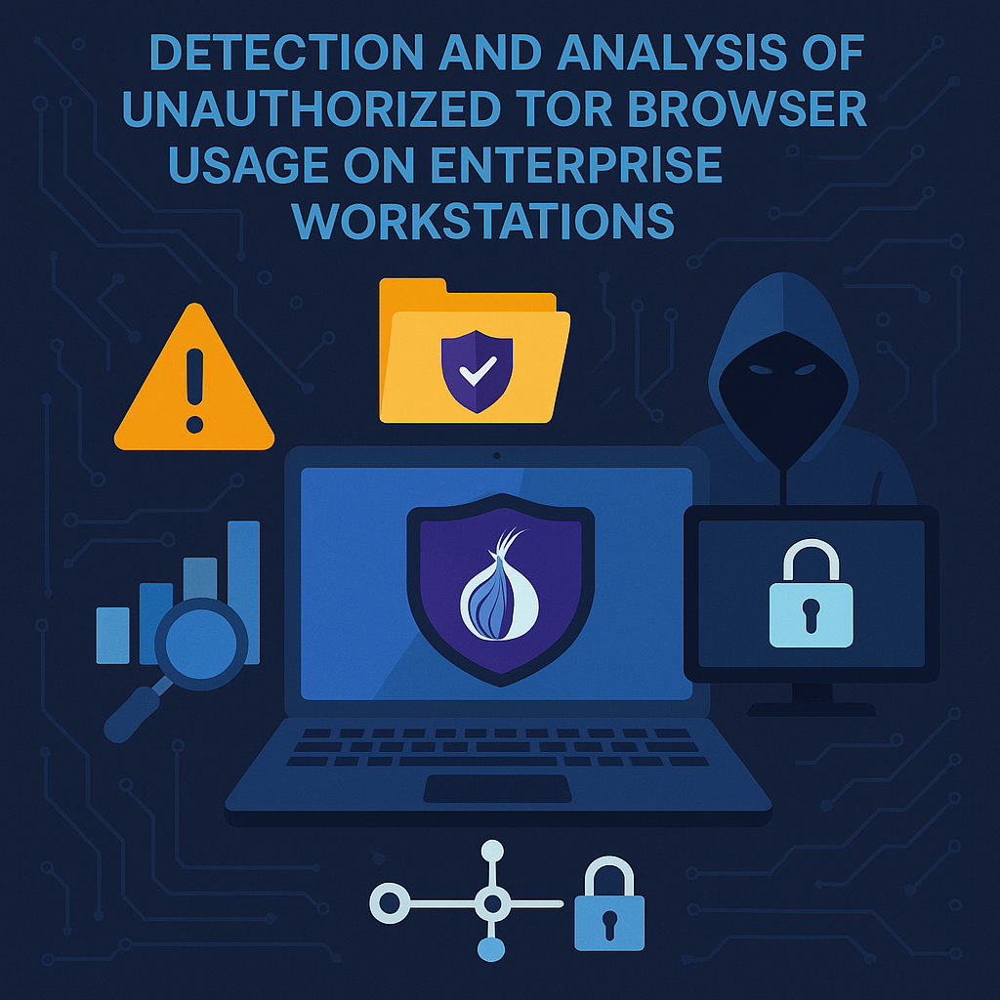
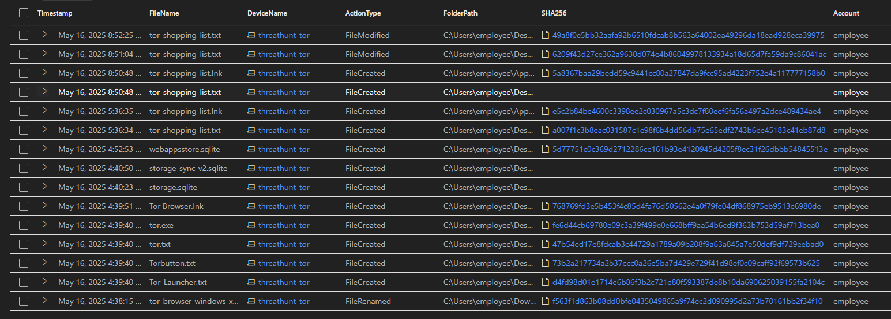
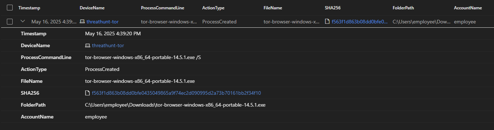
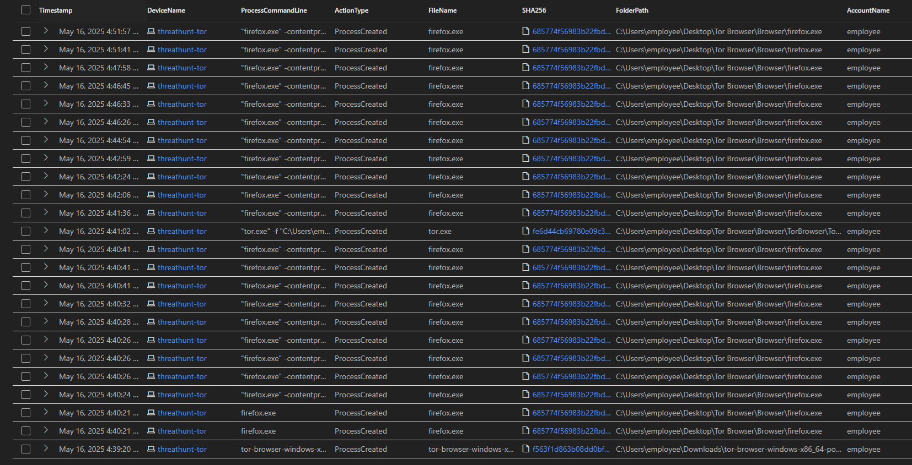
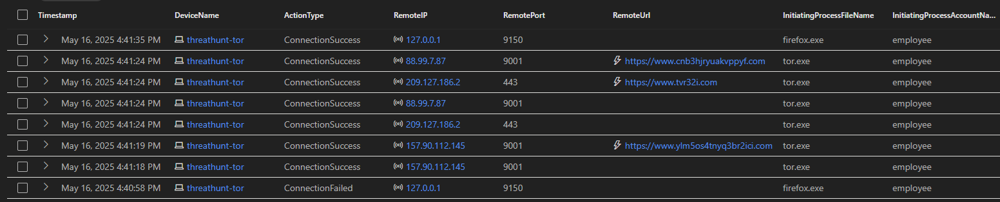
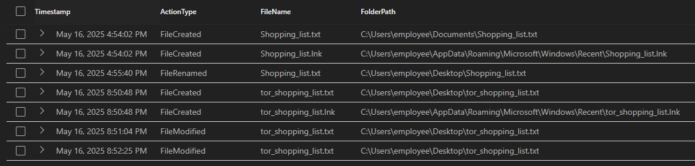

## Detection and Analysis of Unauthorized TOR Browser Usage

 

## Threat Hunt Report: Unauthorized TOR Usage
- [Scenario Creation](https://github.com/Bharathkasyap/threat-hunting-scenario-tor-Bharath/blob/main/Update%20threat-hunting-scenario-tor-event-creation.md)

## Platforms and Languages Leveraged
- Windows 10 Virtual Machines (Microsoft Azure)
- EDR Platform: Microsoft Defender for Endpoint
- Kusto Query Language (KQL)
- Tor Browser

##  Scenario

Management suspects that some employees may be using TOR browsers to bypass network security controls because recent network logs show unusual encrypted traffic patterns and connections to known TOR entry nodes. Additionally, there have been anonymous reports of employees discussing ways to access restricted sites during work hours. The goal is to detect any TOR usage and analyze related security incidents to mitigate potential risks. If any use of TOR is found, notify management.

### High-Level TOR-Related IoC Discovery Plan

- **Check `DeviceFileEvents`** for any `tor(.exe)` or `firefox(.exe)` file events.
- **Check `DeviceProcessEvents`** for any signs of installation or usage.
- **Check `DeviceNetworkEvents`** for any signs of outgoing connections over known TOR ports.

---

### Threat Hunt Methodology
This threat hunt was conducted using a combination of endpoint detection and response (EDR) data and network logs. The following methodology was employed:
1. Data Collection: Gathering relevant logs from the endpoint (DeviceFileEvents, DeviceProcessEvents) and network activity (DeviceNetworkEvents).
2. Initial Analysis: Searching for TOR-related file and process activity on the endpoint.
3. Network Analysis: Examining network connections for TOR-related traffic patterns (specific ports and IPs).
4. Timeline Creation: Constructing a chronological timeline of events to understand the sequence of actions.
5. MITRE ATT&CK Mapping: Mapping identified activities to the MITRE ATT&CK framework.
6. Reporting: Documenting the findings, including the timeline, TTPs, and recommendations.
---

## Steps Taken

### Step 1: File Discovery - TOR Installer

Searched **DeviceFileEvents** table for any file that had the string **‘tor’** in it and discovered what looks like the user **“employee”** downloaded a tor installer, did something that resulted in many tor-related files being copied to the desktop and the creation of a file called **‘Shopping_list’** on the desktop at May 16, 2025 4:44:36 PM. These events began at: 2025-05-16T21:38:15.9741931Z

**Query used to locate events:**

```kql
DeviceFileEvents
| where DeviceName == 'threathunt-tor'
| where FileName contains 'tor'
| where InitiatingProcessAccountName != 'system'
| where Timestamp >= datetime(2025-05-16T21:38:15.9741931Z)
| order by Timestamp
| project Timestamp, FileName,DeviceName, ActionType, FolderPath, SHA256, Account= InitiatingProcessAccountName
```


### Findings:
1. Portable TOR browser (tor-browser-windows-x86_64-portable-14.5.1.exe) found in Downloads folder (C:\Users\employee\Downloads).
2. Found file named tor_shopping_list.txt created on the Desktop.
3. SHA256 of installer: f563f1d863b08dd0bfe0435049865a9f74ec2d090995d2a73b70161bb2f34f10

---

### Step 2: Silent Installation Detection

Searched for any **process command line** that contains the string **‘ tor-browser-windows-x86_64-portable-14.5.1’** based on logs returned at **May 16, 2025, at 4:39 PM**, a process was created on the device named threathunt-tor by the user account employee. The executed command was tor-browser-windows-x86_64-portable-14.5.1.exe /S, which was run from the downloads folder located at C:\Users\employee\Downloads. The file involved is a portable version of the TOR browser, and its SHA256 hash is:f563f1d863b08dd0bfe0435049865a9f74ec2d090995d2a73b70161bb2f34f10. 

This action indicates that the user installed or ran the TOR browser on the system using a command that triggered a silent installation.

**Query used to locate events:**

```kql

DeviceProcessEvents
| where DeviceName == 'threathunt-tor'
| where ProcessCommandLine contains 'tor-browser-windows-x86_64-portable-14.5.1.exe'
| project Timestamp, DeviceName, ProcessCommandLine, ActionType, FileName, SHA256, FolderPath, AccountName 
```


### Finding:
1. TOR was installed silently using the /S command-line switch.
---

### Step 3: Application Execution - TOR Browser 

Searched the DeviceProcessEvents table for any indications that the user “employee” actually opened the Tor browser. There is evidence that they did open this at May 16, 2025 4:40:21 PM, there were several other instances of firefox.exe (Tor) as well as Tor.exe spawned afterwards.

**Query used to locate events:**

```kql
DeviceProcessEvents
| where DeviceName == 'threathunt-tor'
| where FileName has_any ("tor.exe", "start-tor-browser.exe", "torbrowser.exe", "firefox.exe", "tor-browser-windows", "tor-browser-windows-x86_64-portable")
or ProcessCommandLine has_any ("start-tor-browser", "torproject.org", ".onion", "Tor Browser")
| project Timestamp, DeviceName, ProcessCommandLine, ActionType, FileName, SHA256, FolderPath, AccountName 
| order by Timestamp
```


### Finding:
1. TOR browser launched (tor.exe), including multiple firefox.exe subprocesses, indicating active use.
---

### Step 4: Network Communication over TOR Ports

Searched for DeviceNetworkEvents table for any identification that Tor Browser was used to establish a connection using any of the known ports. On May 16, 2025, multiple network events were recorded on the device "threathunt-tor" involving the user account "employee", indicating active use of the TOR browser. The logs show several successful outbound connections from the process tor.exe to known external IP addresses over port 9001, which is commonly used by TOR relay nodes. Additionally, there were connection attempts from firefox.exe to local proxy ports such as 9150, which was consistent with TOR browser startup behavior. Some connections were also associated with suspicious domain names resembling .onion-like encrypted traffic patterns. These activities strongly suggest the use of TOR for anonymized or proxy-based communication within the network environment. There were a couple of other connections to sites over port 443.

**Query used to locate events:**

```kql
DeviceNetworkEvents
| where DeviceName == 'threathunt-tor'
| where InitiatingProcessFileName in ("tor.exe", "firefox.exe")
| where RemotePort in (9001, 9030, 9040, 9050, 9150, 443,80)  // Common TOR ports
| where InitiatingProcessAccountName != 'system'
| project Timestamp, DeviceName, ActionType, RemoteIP,  RemotePort, RemoteUrl, InitiatingProcessFileName, InitiatingProcessAccountName
| order by Timestamp
```


### Finding:
1. Traffic observed to TOR relays (e.g., 88.99.7.87:9001, 157.90.112.145:9001) and .onion routing endpoints (e.g., https://www.cnb3hjryuakvppyf.com, https://www.jylm5scs4xrqbkrj.com).
2. Connections to localhost proxy 127.0.0.1:9150 by firefox.exe
---
### Step 5: Artifact File Creation 
Searched the DeviceFileEvents table for any other files created that could potentially be a threat, focusing on filenames containing 'shopping_list'. The query revealed the creation, modification, and deletion of files related to a shopping list on the user's desktop and in their recent items/documents folder.

**Query used to locate events:**

```kql
DeviceFileEvents
| where FileName contains 'shopping_list'
| project Timestamp, ActionType, FileName, FolderPath
```



### Findings:
1. File tor_shopping_list.txt created on the Desktop (C:\Users\employee\Desktop\tor_shopping_list.txt) at May 16, 2025, 4:44:36 PM.
2. This file was subsequently modified (May 16, 2025, 8:51 PM & 8:52 PM) and then likely deleted, as indicated by later events in the broader timeline.
3. Another file, Shopping_list.txt, was created in C:\Users\employee\Documents\Shopping_list.txt around the same time (May 16, 2025, 4:54 PM).
4. Link files (.lnk) for these shopping lists were also created in C:\Users\employee\AppData\Roaming\Microsoft\Windows\Recent\.
5. This indicates the user might be collecting information or creating a list for personal use, potentially related to the TOR browser activity. The creation and subsequent modification/deletion within a few hours   
   suggest active use and cleanup.


---
## Chronological Event Timeline 

The following is a detailed chronological timeline of the events identified during the threat hunt:
| **Timestamp**       | **Event**                          | **Details**                                                                                        |
| ------------------- | ---------------------------------- | -------------------------------------------------------------------------------------------------- |
| 2025-05-16 16:39:20 | Silent Installation Initiated      | `tor-browser-windows-x86_64-portable-14.5.1.exe /S` executed from Downloads folder.                |
| 2025-05-16 16:40:21 | Tor.exe / Firefox.exe Launched     | Process creation logs confirm TOR browser execution (`tor.exe`, multiple `firefox.exe` instances). |
| 2025-05-16 16:41:24 | TOR Network Connection Established | Outbound IP: `88.99.7.87` via port `9001`. Additional TOR traffic observed on port `9150`.         |
| 2025-05-16 16:44:36 | Shopping List File Created         | `tor_shopping_list.txt` created on Desktop. `shopping_list.txt` also created in Documents.         |
| 2025-05-16 20:52:25 | Shopping List Modified & Deleted   | `tor_shopping_list.txt` edited and later deleted.                                                  |


The tool automatically times out after being inactive for a while. The tool requires MFA, and the employee was observed entering their credentials. The tool is not allowed to be used for personal reasons.

---
## MITRE ATT&CK Mapping

| **Tactic**        | **Technique**                         | **ID**    | **Description**                                                                 |
| ----------------- | ------------------------------------- | --------- | ------------------------------------------------------------------------------- |
| Initial Access    | User Execution: Malicious File        | T1204.002 | TOR executable was manually executed by the user.                               |
| Defense Evasion   | Obfuscated Files or Information       | T1027     | TOR uses encrypted channels, evading standard network monitoring tools.         |
| Command & Control | Encrypted Channel: Non-Standard Ports | T1573.002 | TOR established connections over ports 9001 and 9150, common for TOR traffic.   |
| Collection        | Data from Information Repositories    | T1213     | User created text files possibly containing sensitive or illicit shopping info. |
| Exfiltration      | Exfiltration Over C2 Channel          | T1041     | Data may have been exfiltrated using TOR’s hidden proxy infrastructure.         |

---
## Recommendations
1. TOR Port Blocking: Block known TOR entry and exit node ports (e.g., 9001, 9030, 9050, 9150) at the perimeter firewall and internal network segments.
2. Application Whitelisting: Implement application whitelisting (e.g., using AppLocker) to prevent the execution of unauthorized and unsigned portable applications like the TOR browser.
3. DLP Monitoring: Enhance Data Loss Prevention (DLP) policies to alert on the creation or transfer of files with suspicious keywords such as .onion, market, tor_shopping, or other terms indicative of dark web 
   activity or policy violation.
4. User Awareness Training: Conduct regular user awareness training sessions to educate employees on acceptable use policies, the risks associated with anonymous browsing tools like TOR on corporate networks, and 
   the implications of policy violations.
5. Enhanced SIEM Visibility & Hunting: Regularly conduct proactive threat hunts focusing on DeviceFileEvents, DeviceNetworkEvents, and ProcessCommandLine arguments for known TOR indicators and suspicious patterns. 
   Integrate updated threat intelligence feeds for TOR nodes.
---
## Summary

This threat hunt successfully identified unauthorized use of the Tor Browser on the **threathunt-tor** endpoint. The investigation confirmed the silent installation of a portable **TOR browser**, its execution, and subsequent anonymized browsing patterns, including connections to TOR network nodes and the creation of related **artifact files**. While **no direct data exfiltration** was definitively observed during this specific hunt, the circumvention of corporate security controls represents a **significant policy violation** and introduces a potential **risk vector for malicious activities or data leakage**. Immediate response actions, including endpoint isolation and stakeholder notification, were taken. Controls have been hardened through updated SIEM rules and recommendations for policy and technical control enhancements have been made to prevent recurrence and improve the organization's overall security posture.

---

## Response Taken

1. Isolated Endpoint: Host threathunt-tor was removed from the network to prevent further unauthorized activity or potential data exfiltration.
2. User Notification: HR and the user's direct manager were alerted regarding the policy violation and potential misuse of company assets.
3. Artifacts Archived: The TOR installer (tor-browser-windows-x86_64-portable-14.5.1.exe), tor_shopping_list.txt file hashes, and relevant logs (DeviceFileEvents, DeviceProcessEvents, DeviceNetworkEvents) were 
   preserved for further investigation and as evidence.
4. SIEM Rules Updated: Queries and alerts for TOR indicators (specific process names, file names, network ports, known TOR node IPs) were added to threat detection playbooks and the SIEM system to enhance future 
   detection capabilities.
 ---

